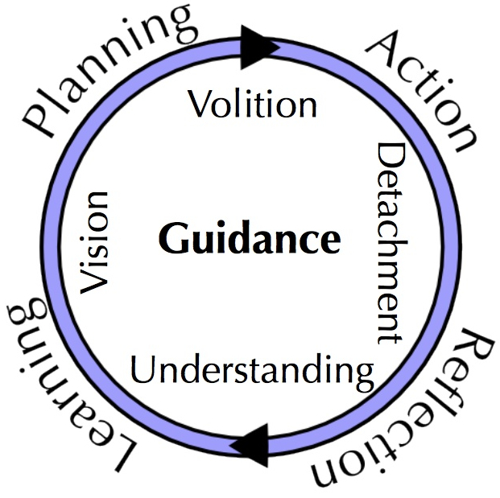

# Advice for new programmers

## Break down problems into smaller problems :hammer:

Know what you want to accomplish, but take some time to break the problem down into smaller problems. [Behavior Driven Development (BDD)](https://en.wikipedia.org/wiki/Behavior-driven_development) and to a lesser extent, [Test Driven Development (TDD)](https://en.wikipedia.org/wiki/Test-driven_development) can help with thinking about likely input and desired output and help you avoid [tight coupling](https://stackoverflow.com/questions/2832017/what-is-the-difference-between-loose-coupling-and-tight-coupling-in-the-object-o) and side-effects.

In many ways, software Development is more about problem solving than coding.

## Build on the shoulder of ... :computer: package managers

Don't start from scratch if you don't have to. Look for a package manager which has packages that other people have written and actively develop and maintain. 

* Node and Javascript: npm via https://www.npmjs.com/
* Python: pip via https://pypi.org/
* Java and Scala: maven via https://mvnrepository.com/
* .NET: https://www.nuget.org/
* MacOS: https://brew.sh/
* Windows: https://chocolatey.org/ :chocolate_bar:
* _(Almost) Everything_: https://libraries.io/ :books:

Look at number of downloads, how aften it is updated, how long it has been around, Github stars and so on to see if it likely to be actively maintained. Otherwise you might need to fork the reposity on Github and maintain it yourself at some point.

## Advice from some new programmers at my work ...

- It can be done!
    * Most things in software are possible given enough time, budget, research, perseverance and grit
    * Learn by doing
    * If you start to get overwhelmed, break it down into smaller parts and go step by step
- Don't underestimate testing (and living documentation)
    * Easier to maintain your code
    * Refactor / change code with a safety net
    * Document common use cases in tests
    * Better to Test than Debug
        - Write a failing test when you find an issue or defect
        - Fix the code and make it pass
    * Have empathy for others and your future self. You might:
        - come back to this code in 9 months or 2 years. What does it do?
        - be handing this code off to the next Apprenti gradudate hired at your company
- Productivity Hacks
    * Shell Scripts
        - $HOME/.bash_login -- stuff that should happen every time you login
        - Aliases -- one liners
                - `alias clone='git clone "https://github.com/${ORG}/${REPO}.git" && cd "${REPO}" && git checkout -b new-feature && npm install'`
                - clone josher19/new_programmer
        - export PATH="$PATH:$HOME/bin"
        - PowerShell for you Windows people or install [bash on Windows 10](https://www.windowscentral.com/how-install-bash-shell-command-line-windows-10)
    * Version Control (git)
        - Go back in time to when things worked
        - Allows multiple people to work on the same project without stepping on each other's toes :footprints:
        - [git flow vs. trunk bases development](https://www.toptal.com/software/trunk-based-development-git-flow)
    * Your IDE is your friends
        - vi
            - `:q` or `:x`
            - useful to know if you are doing lots of server side and/or Docker development
        - VSCode
            - [Snippets](https://code.visualstudio.com/docs/editor/userdefinedsnippets)
                * Preferences > User Snippets > Javascript (JS)
            - Stack traces
                * Find first or last error in your own code
                * If the error is easy to fix and in an imported library, don't be afraid to make a [PR](https://github.com/Marak/colors.js/pull/261/files) (with tests)
            - Debugging
                * Break points
                * You can use [Chrome as a Debugger](ttps://medium.com/@paul_irish/debugging-node-js-nightlies-with-chrome-devtools-7c4a1b95ae27)
                    - `node --inspect-brk file.js`
                    - chrome://inspect/
- Communication is Key
    * Better to over-communicate than to under-communicate (in most organizations)
        - If you are stuck, ask for help
        - Help others who get stuck (empathy)
    * Where to go for help
        - (Usually) okay to ask questions (earphones == in coding flow)
        - But first might check your company's available source code and then Stack Overflow
        - See if this problem has already been solved
        - Open Source solutions and/or vendor lock in
        - Networking
    * Beware of Scope Creep
        - adding too much too soon worse than Minimum Viable Product (MVP) with real user feedback
    * Better to over-estimate time and beat your estimate than to under-estimate and be late & over budget :money_with_wings:
- Cultural Fit (and interviews)
    - Command and Control
        * From Ship Captain to Captains of Industry and Industrialism to Global CEO's
            - Shareholder Value $$$ vs. Stakeholder Values
    - [Open / Agile](https://www.openagile.org/)
        * Transparency (Truthfulness)
        * Retrospective as part of the Learning Circle
            * Action, Reflection, Learning, Planning, Action, ...
            * Systematically learn from your "mis-steps" :footprints:
        * Consultative Decision Making
            - 3 roles in [Scrum](https://scrum.org) / OpenAgile:
                - Team Member
                - Scrum Master / Process Facilitator
                - Product Owner / Growth Facilitator
    - Most companies somewhere in-between those two extremes
- Keep Learning!

