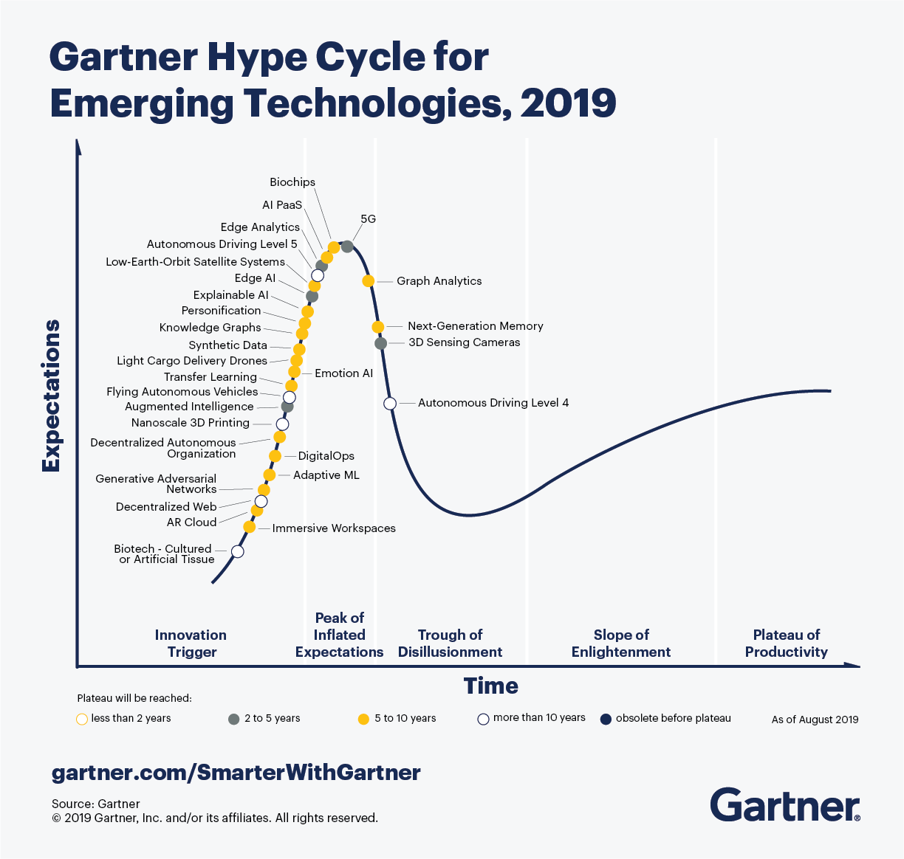

# Future Predictions :crystal_ball:

> The future is but a reflection of our imagination, the past is but a memory, ... all we have is the now.

_Note_: It is easy to **over-estimate** the effect of technology in 2-5 years and severely **underestimate** effect in 10+ years.

## Less of:
- Older "Big Data" Technologies
    - Hadoop
    - Spark ML
    - Scala
- Competitive advantage
- International influence :us:

## More of:
- Full Stack developers
    - JavaScript
    - ReactJS
    - VueJS
    - NodeJS
    - GoLang
- DevOps
    - Infrastructure automation
    - Enterprise Cloud Computing
    - Docker and Kubernetes
    - Infrastructure as Code
        - [ServerlessJS](https://serverless.com/),
        - Terraform, 
        - AWS CloudFormation
        - ...
- Data Science
    - Python
    - Possibly Julia or other new, faster Data-first language
    - Auto ML
- Voice controlled everything
    - Alexa Toolkit
    - Google, Siri will eventually make competing toolkits
    - Programming voice with voice?
- (Relatively) Cheap robots
    - Baby Boomers
    - Millenials
- Code of Ethics for Programmers and Data Scientists
- Climate Change
    - Electric Vehicles
    - Self-driving cars
    - Renewable Energy
    - Flooding near coasts
    - Droughts
- Hype Cycle
    - Unicorns (>$1B startups) :unicorn:
        - Hype cycle: boom, bust (now), and new normal
    - Machine Learning / AI :robot:
        - Hype cycle: boom (now), bust, and new normal

